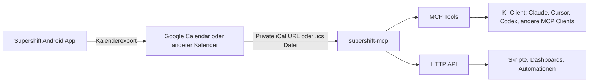
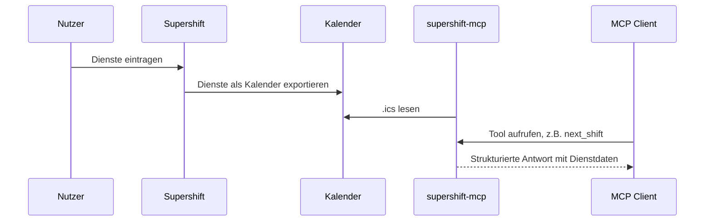
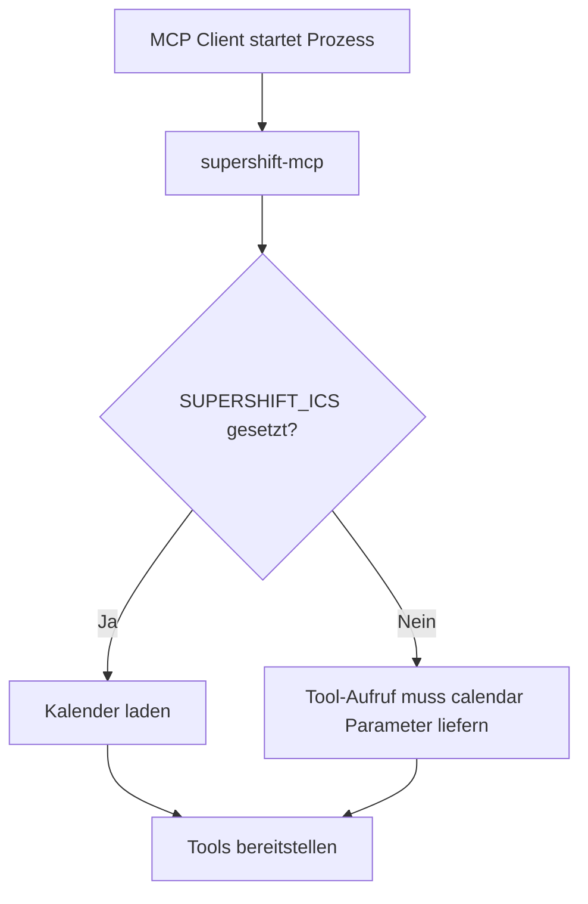
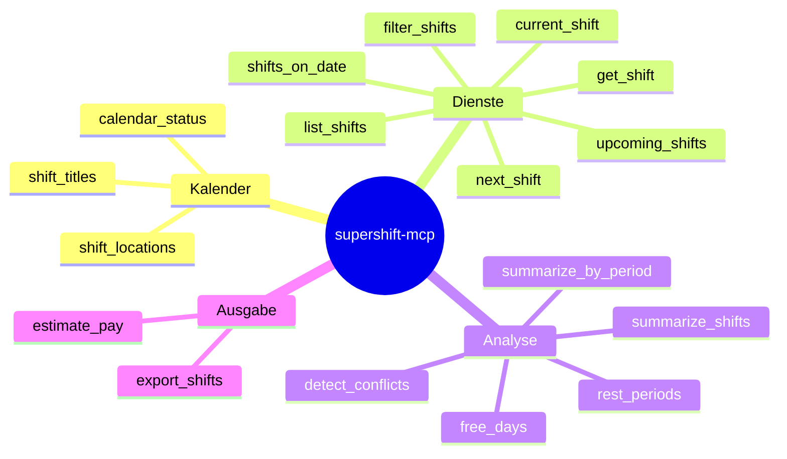
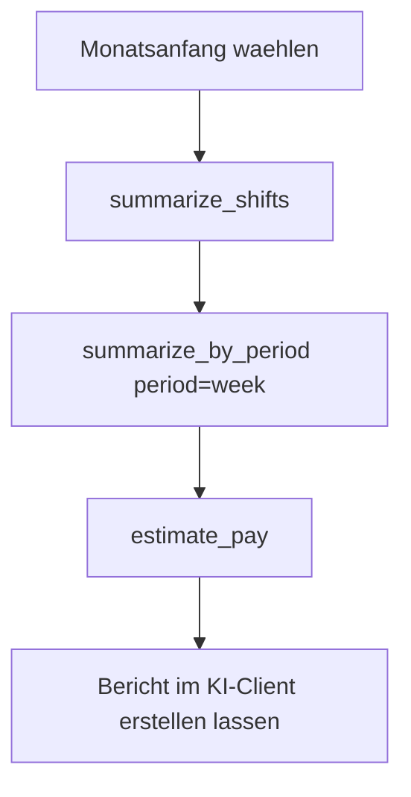
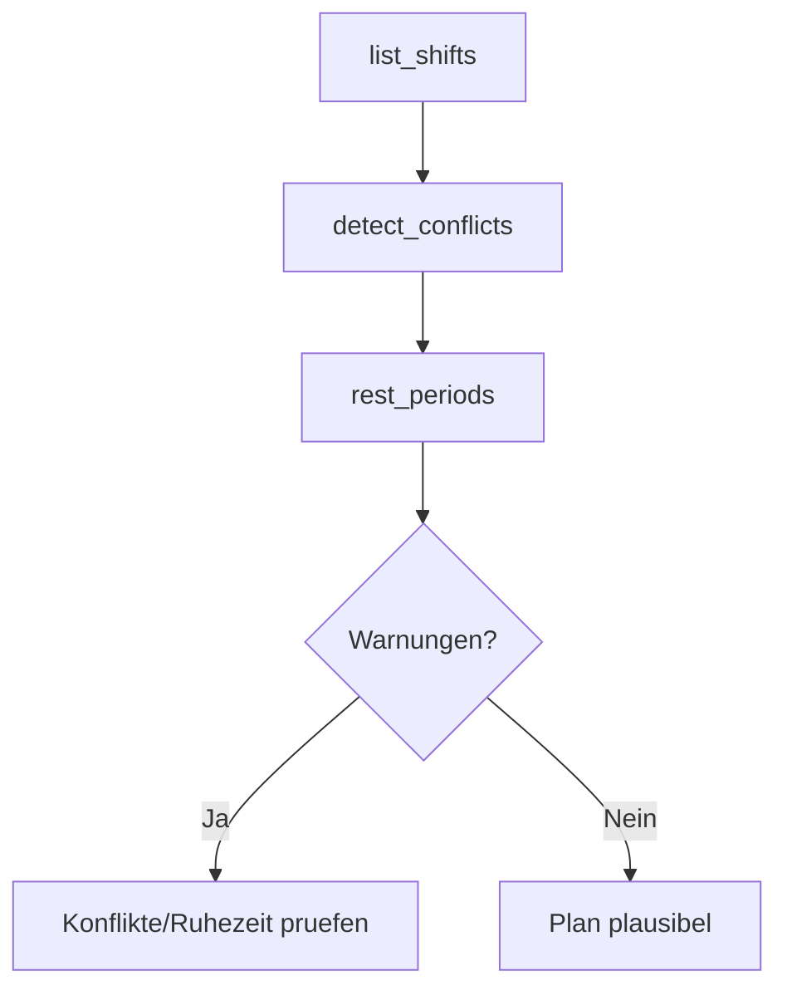

# supershift-mcp

MCP- und HTTP-Bridge fuer Dienstplaene, die aus
[Supershift](https://supershift.app/) als Kalender exportiert werden.

> Status: Inoffizielles Community-Projekt. Es liest exportierte Kalenderdaten,
> aber schreibt nicht direkt in die Supershift Android-App.

[](https://github.com/Zyrial96/supershift-mcp/actions/workflows/ci.yml)

## Was ist das?

Supershift selbst bietet nach aktueller Recherche keine dokumentierte
oeffentliche API und keinen offiziellen MCP-Server. Der robuste Integrationsweg
ist deshalb der Kalenderexport: Supershift kann Dienste in einen externen
Kalender exportieren, und dieser Kalender kann als `.ics` Datei oder private
iCal-URL gelesen werden.

`supershift-mcp` macht daraus:

- einen MCP-Server fuer KI-Clients
- eine optionale FastAPI HTTP-API
- Analysefunktionen fuer Dienste, Ruhezeiten, Konflikte, freie Tage und Stunden
- Exportfunktionen in JSON, CSV und Markdown
- eine einfache Lohnschaetzung anhand von Stundensaetzen

## Architektur



## Datenfluss



## Was geht und was nicht?

| Bereich | Status | Hinweis |
| --- | --- | --- |
| Dienste auslesen | Ja | Ueber `.ics` Datei oder private iCal-URL |
| Naechsten Dienst finden | Ja | MCP Tool `next_shift` |
| Aktuellen Dienst finden | Ja | MCP Tool `current_shift` |
| Stunden summieren | Ja | Nach Zeitraum, Titel, Tag, Woche, Monat |
| Konflikte erkennen | Ja | Ueberlappende Kalenderereignisse |
| Ruhezeiten pruefen | Ja | Standard: 11 Stunden Mindest-Ruhezeit |
| Freie Tage finden | Ja | Zeitraumbezogene Auswertung |
| CSV/JSON/Markdown exportieren | Ja | Tool `export_shifts` |
| Lohn grob schaetzen | Ja | Mit Standard- und Titel-spezifischen Saetzen |
| Direkt in Supershift schreiben | Nein | Keine offizielle Schreib-API bekannt |
| Supershift Cloud Sync reverse engineeren | Nein | Bewusst nicht enthalten |

## Voraussetzungen

- Python 3.11 oder neuer
- Ein aus Supershift exportierter Kalender
- Entweder eine lokale `.ics` Datei oder eine private iCal-URL
- Ein MCP-faehiger Client, wenn du den MCP-Server nutzen willst

## Kalenderquelle vorbereiten

### Option A: Lokale `.ics` Datei

Exportiere oder speichere deinen Kalender als Datei, zum Beispiel:

```bash
/Users/dein-name/Kalender/supershift.ics
```

Dann setzt du:

```bash
export SUPERSHIFT_ICS="/Users/dein-name/Kalender/supershift.ics"
```

### Option B: Private iCal-URL

Wenn Supershift in Google Calendar exportiert, kannst du die private iCal-URL
des Kalenders verwenden. Google beschreibt den Weg unter
[Sync your calendar with computer programs](https://support.google.com/calendar/answer/37648?hl=en):

1. Google Calendar im Browser oeffnen.
2. Einstellungen oeffnen.
3. Links unter "Settings for my calendars" den Kalender auswaehlen.
4. "Integrate calendar" oeffnen.
5. "Secret address in iCal format" kopieren.
6. Diese URL als `SUPERSHIFT_ICS` verwenden.

```bash
export SUPERSHIFT_ICS="https://calendar.google.com/calendar/ical/.../basic.ics"
```

Wichtig: Diese URL ist ein geheimer Lesezugriff auf deinen Kalender. Lege sie
nicht in Git ab und teile sie nicht oeffentlich.

## Installation

### Schnellinstallation aus GitHub

```bash
python3 -m pip install "git+https://github.com/Zyrial96/supershift-mcp.git"
```

Danach sollte der Befehl verfuegbar sein:

```bash
supershift-mcp
```

### Lokale Entwicklung

```bash
git clone https://github.com/Zyrial96/supershift-mcp.git
cd supershift-mcp
python3 -m venv .venv
. .venv/bin/activate
python -m pip install -e ".[api,dev]"
python -m pytest
```

## MCP verwenden

Der MCP-Server laeuft ueber stdio. Das ist der Standardmodus fuer viele
MCP-Clients: Der Client startet den Prozess und spricht direkt mit ihm.



### Minimale MCP-Konfiguration

Viele MCP-Clients verwenden ein JSON-Format mit `mcpServers`:

```json
{
  "mcpServers": {
    "supershift": {
      "command": "supershift-mcp",
      "env": {
        "SUPERSHIFT_ICS": "/Users/dein-name/Kalender/supershift.ics"
      }
    }
  }
}
```

Wenn `supershift-mcp` nicht im `PATH` liegt, verwende den absoluten Pfad:

```json
{
  "mcpServers": {
    "supershift": {
      "command": "/Users/dein-name/Projekte/supershift-mcp/.venv/bin/supershift-mcp",
      "env": {
        "SUPERSHIFT_ICS": "https://calendar.example/private/basic.ics"
      }
    }
  }
}
```

### Sicherheitsvariante mit Umgebungsdatei

Lege deine URL zum Beispiel in einer lokalen Shell-Konfiguration oder einem
Secret-Manager ab. Vermeide diese Datei im Git-Repo:

```bash
export SUPERSHIFT_ICS="https://calendar.example/private/basic.ics"
supershift-mcp
```

## Beispielprompts fuer den MCP

Sobald der MCP in deinem Client verbunden ist, kannst du zum Beispiel fragen:

| Ziel | Beispielprompt |
| --- | --- |
| Naechster Dienst | "Wann ist mein naechster Dienst?" |
| Tagesuebersicht | "Welche Dienste habe ich am 24.06.2026?" |
| Monatsstunden | "Fasse meine Dienststunden fuer Juni 2026 zusammen." |
| Ruhezeit | "Pruefe meine Ruhezeiten im Juli 2026 und zeige Warnungen." |
| Konflikte | "Finde ueberlappende Dienste im aktuellen Monat." |
| Freie Tage | "Welche Tage sind zwischen dem 1. und 15. Juli frei?" |
| Lohnschaetzung | "Schaetze meinen Lohn fuer Juni mit 22 EUR pro Stunde." |
| Export | "Exportiere meine Dienste der naechsten Woche als Markdown-Tabelle." |

## MCP Tools

### Uebersicht

| Tool | Zweck |
| --- | --- |
| `calendar_status` | Kalender-Metadaten, erster und letzter Dienst |
| `list_shifts` | Dienste in einem Zeitraum listen |
| `filter_shifts` | Dienste nach Titel, Ort, Notiz und Dauer filtern |
| `get_shift` | Einzelnen Dienst anhand der UID finden |
| `current_shift` | Aktuell laufenden Dienst finden |
| `shifts_on_date` | Alle Dienste eines Tages anzeigen |
| `next_shift` | Naechsten Dienst finden |
| `upcoming_shifts` | Dienste der naechsten X Tage anzeigen |
| `summarize_shifts` | Stunden und Anzahl nach Diensttitel summieren |
| `summarize_by_period` | Stunden nach Tag, Woche, Monat oder Wochentag gruppieren |
| `detect_conflicts` | Ueberlappende Dienste finden |
| `rest_periods` | Ruhezeiten zwischen Diensten berechnen |
| `free_days` | Freie Tage im Zeitraum finden |
| `export_shifts` | Dienste als JSON, CSV oder Markdown exportieren |
| `estimate_pay` | Grobe Lohnschaetzung berechnen |
| `shift_titles` | Alle Diensttitel ausgeben |
| `shift_locations` | Alle Dienstorte ausgeben |

### Tool-Gruppen



## Tool-Beispiele

### Naechsten Dienst finden

```json
{
  "tool": "next_shift",
  "arguments": {
    "after": "2026-06-22T08:00:00+02:00",
    "days": 30
  }
}
```

### Dienste eines Monats summieren

```json
{
  "tool": "summarize_shifts",
  "arguments": {
    "start": "2026-06-01",
    "end": "2026-07-01"
  }
}
```

### Nach Nachtdiensten filtern

```json
{
  "tool": "filter_shifts",
  "arguments": {
    "start": "2026-06-01",
    "end": "2026-07-01",
    "title_contains": "Night"
  }
}
```

### Ruhezeiten pruefen

```json
{
  "tool": "rest_periods",
  "arguments": {
    "start": "2026-06-01",
    "end": "2026-07-01",
    "minimum_hours": 11
  }
}
```

### Lohn schaetzen

```json
{
  "tool": "estimate_pay",
  "arguments": {
    "start": "2026-06-01",
    "end": "2026-07-01",
    "hourly_rate": 22,
    "title_rates": {
      "Night shift": 30
    },
    "currency": "EUR"
  }
}
```

### CSV exportieren

```json
{
  "tool": "export_shifts",
  "arguments": {
    "start": "2026-06-01",
    "end": "2026-07-01",
    "output_format": "csv"
  }
}
```

## HTTP API verwenden

Die HTTP-API ist optional. Installiere das API-Extra:

```bash
python -m pip install -e ".[api]"
```

Starte den Server:

```bash
supershift-api
```

Standardadresse:

```text
http://127.0.0.1:8765
```

### HTTP-Endpunkte

| Endpoint | Beispiel |
| --- | --- |
| `GET /health` | `curl "http://127.0.0.1:8765/health"` |
| `GET /shifts` | `curl "http://127.0.0.1:8765/shifts?start=2026-06-01&end=2026-07-01"` |
| `GET /shifts/filter` | `curl "http://127.0.0.1:8765/shifts/filter?start=2026-06-01&end=2026-07-01&title_contains=Night"` |
| `GET /shifts/current` | `curl "http://127.0.0.1:8765/shifts/current"` |
| `GET /shifts/next` | `curl "http://127.0.0.1:8765/shifts/next?days=30"` |
| `GET /shifts/date/{day}` | `curl "http://127.0.0.1:8765/shifts/date/2026-06-24"` |
| `GET /shifts/{uid}` | `curl "http://127.0.0.1:8765/shifts/abc123"` |
| `GET /summary` | `curl "http://127.0.0.1:8765/summary?start=2026-06-01&end=2026-07-01"` |
| `GET /summary/period` | `curl "http://127.0.0.1:8765/summary/period?start=2026-06-01&end=2026-07-01&period=week"` |
| `GET /conflicts` | `curl "http://127.0.0.1:8765/conflicts?start=2026-06-01&end=2026-07-01"` |
| `GET /rest-periods` | `curl "http://127.0.0.1:8765/rest-periods?start=2026-06-01&end=2026-07-01"` |
| `GET /free-days` | `curl "http://127.0.0.1:8765/free-days?start=2026-06-01&end=2026-07-01"` |
| `GET /export` | `curl "http://127.0.0.1:8765/export?start=2026-06-01&end=2026-07-01&output_format=csv"` |
| `GET /pay` | `curl "http://127.0.0.1:8765/pay?start=2026-06-01&end=2026-07-01&hourly_rate=22"` |
| `GET /titles` | `curl "http://127.0.0.1:8765/titles"` |
| `GET /locations` | `curl "http://127.0.0.1:8765/locations"` |

## Datums- und Zeitformat

Empfohlen sind ISO-8601 Werte:

```text
2026-06-01
2026-06-01T08:00:00+02:00
2026-06-01T06:00:00Z
```

Ein Zeitraum ist immer `start` inklusiv und `end` exklusiv. Fuer einen ganzen
Monat nutzt du also:

```text
start=2026-06-01
end=2026-07-01
```

## Typische Workflows

### Monatsauswertung



### Dienstplan-Check



## Datenschutz und Sicherheit

- Die private iCal-URL ist ein Geheimnis.
- Lege `SUPERSHIFT_ICS` nicht in Git ab.
- Der MCP schreibt keine Daten zurueck nach Supershift.
- Die HTTP-API bindet standardmaessig nur an `127.0.0.1`.
- Wenn du die API im Netzwerk erreichbar machst, schuetze sie selbst mit
  Reverse Proxy, Authentifizierung oder Firewall.

## Grenzen

Dieses Projekt arbeitet mit dem Kalenderexport. Es kann daher nur sehen, was im
exportierten Kalender steht. Wenn Supershift in Zukunft eine offizielle API
veroeffentlicht, kann ein echter Schreib-Adapter ergaenzt werden.

Nicht enthalten:

- Login in Supershift Cloud Sync
- Reverse Engineering privater Supershift-Endpunkte
- Direkte Android-App-Automation
- Automatisches Veraendern deiner Dienste in Supershift

## Entwicklung

```bash
python -m pytest
ruff check .
```

CI laeuft in GitHub Actions bei Push und Pull Request.
