# supershift-mcp

MCP- und HTTP-Bridge fuer Dienstplaene, die aus
[Supershift](https://supershift.app/) als Kalender exportiert werden.

> Status: Inoffizielles Community-Projekt. Es liest exportierte Kalenderdaten,
> kann Dienste ueber kontrollierte Android-UI-Automation vorbereiten/eintragen
> und enthaelt Reverse-Engineering-Werkzeuge fuer APK, Deep-Links, lokale
> App-Daten und Supershift-Cloud-Payload-Preview.

[](https://github.com/Zyrial96/supershift-mcp/actions/workflows/ci.yml)

## Was ist das?

Supershift selbst bietet nach aktueller Recherche keine dokumentierte
oeffentliche API und keinen offiziellen MCP-Server. Der robuste Integrationsweg
ist deshalb der Kalenderexport: Supershift kann Dienste in einen externen
Kalender exportieren, und dieser Kalender kann als `.ics` Datei oder private
iCal-URL gelesen werden.

`supershift-mcp` macht daraus:

- einen MCP-Server fuer KI-Clients
- eine optionale FastAPI HTTP-API
- Analysefunktionen fuer Dienste, Ruhezeiten, Konflikte, freie Tage und Stunden
- Exportfunktionen in JSON, CSV und Markdown
- eine einfache Lohnschaetzung anhand von Stundensaetzen
- ADB-gestuetzte Schreib-Backends fuer eigene Android-Geraete
- Reverse-Engineering-Hilfen fuer APK-Manifest, Split-APK-Install, Deep-Links,
  Realm-Datenzugriff und Cloud-CRUD-Payloads

## Architektur

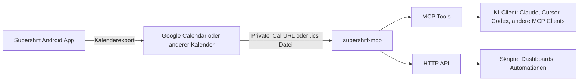

## Datenfluss

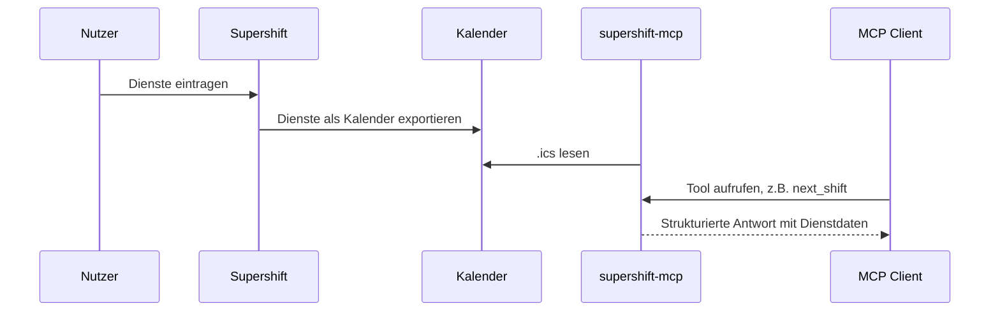

## Was geht und was nicht?

| Bereich | Status | Hinweis |
| --- | --- | --- |
| Dienste auslesen | Ja | Ueber `.ics` Datei oder private iCal-URL |
| Naechsten Dienst finden | Ja | MCP Tool `next_shift` |
| Aktuellen Dienst finden | Ja | MCP Tool `current_shift` |
| Stunden summieren | Ja | Nach Zeitraum, Titel, Tag, Woche, Monat |
| Konflikte erkennen | Ja | Ueberlappende Kalenderereignisse |
| Ruhezeiten pruefen | Ja | Standard: 11 Stunden Mindest-Ruhezeit |
| Freie Tage finden | Ja | Zeitraumbezogene Auswertung |
| CSV/JSON/Markdown exportieren | Ja | Tool `export_shifts` |
| Lohn grob schaetzen | Ja | Mit Standard- und Titel-spezifischen Saetzen |
| Direkt in Supershift schreiben | Experimentell ja | Ueber ADB-UI-Automation mit Dry-Run und Opt-in |
| Android Calendar Intent | Ja | Oeffnet Androids generische Kalender-Eintragsmaske |
| Supershift APK analysieren | Ja | Manifest, Split-Pflicht, Permissions, Deep-Links |
| Supershift Split-APKs installieren | Ja | `adb install-multiple`, standardmaessig Dry-Run |
| Deep-Links testen | Ja | `app.supershift`, `https://supershift.app/open/...`, `https://supr.sh/...` |
| Lokale App-Datenzugriffe pruefen | Ja | `run-as`/Root-Status und Backup-Pull-Plan |
| Direkt in lokale Supershift-DB schreiben | Ja, experimentell | `Supershift.db` auf Emulator/root; live mit Testdienst verifiziert |
| Supershift Cloud CRUD vorbereiten | Preview | Baut Payload fuer `POST https://supershift.app/api/v3/crud`, sendet ihn aber nicht blind |
| Supershift Cloud Sync voll schreiben | Nein | Erst nach verifiziertem Auth-/Device-Kontext aus deiner eigenen Installation |

## Voraussetzungen

- Python 3.11 oder neuer
- Ein aus Supershift exportierter Kalender
- Entweder eine lokale `.ics` Datei oder eine private iCal-URL
- Ein MCP-faehiger Client, wenn du den MCP-Server nutzen willst

## Kalenderquelle vorbereiten

### Option A: Lokale `.ics` Datei

Exportiere oder speichere deinen Kalender als Datei, zum Beispiel:

```bash
/Users/dein-name/Kalender/supershift.ics
```

Dann setzt du:

```bash
export SUPERSHIFT_ICS="/Users/dein-name/Kalender/supershift.ics"
```

### Option B: Private iCal-URL

Wenn Supershift in Google Calendar exportiert, kannst du die private iCal-URL
des Kalenders verwenden. Google beschreibt den Weg unter
[Sync your calendar with computer programs](https://support.google.com/calendar/answer/37648?hl=en):

1. Google Calendar im Browser oeffnen.
2. Einstellungen oeffnen.
3. Links unter "Settings for my calendars" den Kalender auswaehlen.
4. "Integrate calendar" oeffnen.
5. "Secret address in iCal format" kopieren.
6. Diese URL als `SUPERSHIFT_ICS` verwenden.

```bash
export SUPERSHIFT_ICS="https://calendar.google.com/calendar/ical/.../basic.ics"
```

Wichtig: Diese URL ist ein geheimer Lesezugriff auf deinen Kalender. Lege sie
nicht in Git ab und teile sie nicht oeffentlich.

## Installation

### Schnellinstallation aus GitHub

```bash
python3 -m pip install "git+https://github.com/Zyrial96/supershift-mcp.git"
```

Danach sollte der Befehl verfuegbar sein:

```bash
supershift-mcp
```

### Lokale Entwicklung

```bash
git clone https://github.com/Zyrial96/supershift-mcp.git
cd supershift-mcp
python3 -m venv .venv
. .venv/bin/activate
python -m pip install -e ".[api,dev]"
python -m pytest
```

## MCP verwenden

Der MCP-Server laeuft ueber stdio. Das ist der Standardmodus fuer viele
MCP-Clients: Der Client startet den Prozess und spricht direkt mit ihm.

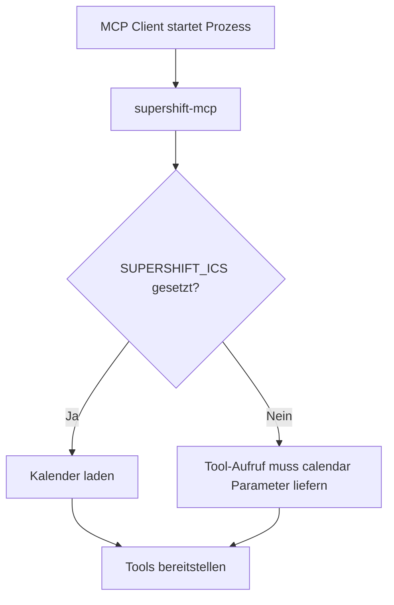

### Minimale MCP-Konfiguration

Viele MCP-Clients verwenden ein JSON-Format mit `mcpServers`:

```json
{
  "mcpServers": {
    "supershift": {
      "command": "supershift-mcp",
      "env": {
        "SUPERSHIFT_ICS": "/Users/dein-name/Kalender/supershift.ics"
      }
    }
  }
}
```

Wenn `supershift-mcp` nicht im `PATH` liegt, verwende den absoluten Pfad:

```json
{
  "mcpServers": {
    "supershift": {
      "command": "/Users/dein-name/Projekte/supershift-mcp/.venv/bin/supershift-mcp",
      "env": {
        "SUPERSHIFT_ICS": "https://calendar.example/private/basic.ics"
      }
    }
  }
}
```

### Sicherheitsvariante mit Umgebungsdatei

Lege deine URL zum Beispiel in einer lokalen Shell-Konfiguration oder einem
Secret-Manager ab. Vermeide diese Datei im Git-Repo:

```bash
export SUPERSHIFT_ICS="https://calendar.example/private/basic.ics"
supershift-mcp
```

## Beispielprompts fuer den MCP

Sobald der MCP in deinem Client verbunden ist, kannst du zum Beispiel fragen:

| Ziel | Beispielprompt |
| --- | --- |
| Naechster Dienst | "Wann ist mein naechster Dienst?" |
| Tagesuebersicht | "Welche Dienste habe ich am 24.06.2026?" |
| Monatsstunden | "Fasse meine Dienststunden fuer Juni 2026 zusammen." |
| Ruhezeit | "Pruefe meine Ruhezeiten im Juli 2026 und zeige Warnungen." |
| Konflikte | "Finde ueberlappende Dienste im aktuellen Monat." |
| Freie Tage | "Welche Tage sind zwischen dem 1. und 15. Juli frei?" |
| Lohnschaetzung | "Schaetze meinen Lohn fuer Juni mit 22 EUR pro Stunde." |
| Export | "Exportiere meine Dienste der naechsten Woche als Markdown-Tabelle." |
| Dienste eintragen | "Trage diese Dienste in Supershift ein: 24.06.2026 06:00-14:00 Fruehdienst ..." |
| Schreibplan pruefen | "Erzeuge erst einen Dry-Run fuer diese Dienste und zeige mir alle ADB-Kommandos." |
| Reverse-Status | "Pruefe, welche Supershift-Schreibwege auf meinem Android-Geraet moeglich sind." |
| Cloud-Preview | "Baue mir fuer diese Dienste einen Supershift Cloud CRUD Preview, aber sende nichts." |

## MCP Tools

### Uebersicht

| Tool | Zweck |
| --- | --- |
| `calendar_status` | Kalender-Metadaten, erster und letzter Dienst |
| `list_shifts` | Dienste in einem Zeitraum listen |
| `filter_shifts` | Dienste nach Titel, Ort, Notiz und Dauer filtern |
| `get_shift` | Einzelnen Dienst anhand der UID finden |
| `current_shift` | Aktuell laufenden Dienst finden |
| `shifts_on_date` | Alle Dienste eines Tages anzeigen |
| `next_shift` | Naechsten Dienst finden |
| `upcoming_shifts` | Dienste der naechsten X Tage anzeigen |
| `summarize_shifts` | Stunden und Anzahl nach Diensttitel summieren |
| `summarize_by_period` | Stunden nach Tag, Woche, Monat oder Wochentag gruppieren |
| `detect_conflicts` | Ueberlappende Dienste finden |
| `rest_periods` | Ruhezeiten zwischen Diensten berechnen |
| `free_days` | Freie Tage im Zeitraum finden |
| `export_shifts` | Dienste als JSON, CSV oder Markdown exportieren |
| `estimate_pay` | Grobe Lohnschaetzung berechnen |
| `shift_titles` | Alle Diensttitel ausgeben |
| `shift_locations` | Alle Dienstorte ausgeben |
| `parse_shifts_text` | Freitext in schreibbare Dienste umwandeln |
| `validate_shifts_for_write` | Schreibdaten validieren |
| `android_device_status` | ADB-Geraete anzeigen |
| `supershift_app_status` | Supershift Installation auf Android pruefen |
| `dump_supershift_ui` | Aktuelle Supershift-UI als XML dumpen |
| `inspect_supershift_apk` | Supershift APK statisch analysieren |
| `supershift_reverse_engineering_report` | Reverse-Engineering-Status und Schreibpfade anzeigen |
| `install_supershift_apks` | Base-/Split-APKs per ADB installieren |
| `probe_supershift_deeplinks` | Supershift Deep-Links per ADB testen |
| `supershift_data_access_status` | `run-as`/Root-Datenzugriff pruefen |
| `pull_supershift_data` | App-Daten per `run-as` exportieren, falls erlaubt |
| `preview_supershift_cloud_crud` | Cloud-CRUD-Payload fuer Dienste vorbereiten |
| `preview_supershift_sqlite_write` | Direkten SQLite-Insert-Plan vorbereiten |
| `create_supershift_sqlite_shifts` | Strukturierte Dienste direkt in `Supershift.db` schreiben |
| `create_supershift_sqlite_shifts_from_text` | Freitext parsen und direkt in `Supershift.db` schreiben |
| `preview_supershift_write` | Schreibplan ohne Ausfuehrung erzeugen |
| `create_supershift_shifts` | Strukturierte Dienste ueber Backend eintragen |
| `create_supershift_shifts_from_text` | Freitext parsen und ueber Backend eintragen |

### Tool-Gruppen

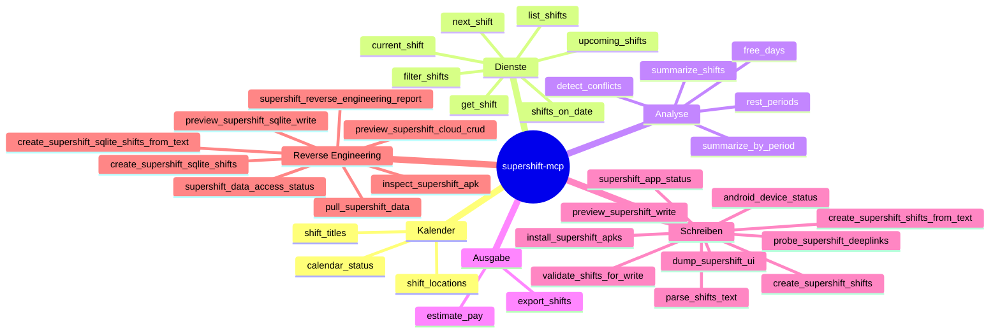

## Tool-Beispiele

### Naechsten Dienst finden

```json
{
  "tool": "next_shift",
  "arguments": {
    "after": "2026-06-22T08:00:00+02:00",
    "days": 30
  }
}
```

### Dienste eines Monats summieren

```json
{
  "tool": "summarize_shifts",
  "arguments": {
    "start": "2026-06-01",
    "end": "2026-07-01"
  }
}
```

### Nach Nachtdiensten filtern

```json
{
  "tool": "filter_shifts",
  "arguments": {
    "start": "2026-06-01",
    "end": "2026-07-01",
    "title_contains": "Night"
  }
}
```

### Ruhezeiten pruefen

```json
{
  "tool": "rest_periods",
  "arguments": {
    "start": "2026-06-01",
    "end": "2026-07-01",
    "minimum_hours": 11
  }
}
```

### Lohn schaetzen

```json
{
  "tool": "estimate_pay",
  "arguments": {
    "start": "2026-06-01",
    "end": "2026-07-01",
    "hourly_rate": 22,
    "title_rates": {
      "Night shift": 30
    },
    "currency": "EUR"
  }
}
```

### CSV exportieren

```json
{
  "tool": "export_shifts",
  "arguments": {
    "start": "2026-06-01",
    "end": "2026-07-01",
    "output_format": "csv"
  }
}
```

## Dienste in Supershift eintragen

Es gibt aktuell keinen dokumentierten Supershift-Write-API-Endpunkt. Die App ist
laut oeffentlichen Beschreibungen bewusst lokal nutzbar und benoetigt keinen
Account und kein Internet. Der realistische Schreibweg ist deshalb Android
UI-Automation ueber ADB: Der MCP kann Supershift starten, UI-Informationen
auslesen, einen Klick-/Textplan erzeugen und diesen erst nach expliziter
Freigabe ausfuehren.

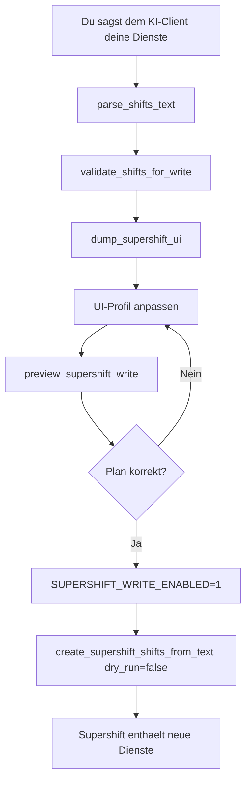

### Warum ein UI-Profil?

Supershift hat keine stabile oeffentliche Schreib-API. Android-UI-Automation
braucht deshalb ein Profil, das beschreibt, welche Schaltflaechen und Felder auf
deinem Geraet in welcher Reihenfolge bedient werden. Das Beispielprofil liegt in
[`examples/supershift-ui-profile.example.json`](examples/supershift-ui-profile.example.json).

Platzhalter im Profil:

| Platzhalter | Bedeutung |
| --- | --- |
| `{title}` | Dienstname |
| `{date}` | Datum im Format `YYYY-MM-DD` |
| `{start_time}` | Startzeit `HH:MM` |
| `{end_time}` | Endzeit `HH:MM` |
| `{location}` | Ort, falls angegeben |
| `{notes}` | Notiz, falls angegeben |

Unterstuetzte Aktionen:

| Aktion | Beispiel |
| --- | --- |
| `tap` | `{"action": "tap", "x": 980, "y": 1840}` |
| `text` | `{"action": "text", "value": "{title}"}` |
| `keyevent` | `{"action": "keyevent", "key": "TAB"}` |
| `swipe` | `{"action": "swipe", "x1": 500, "y1": 1600, "x2": 500, "y2": 500}` |
| `wait` | `{"action": "wait", "seconds": 0.5}` |

### 1. Android vorbereiten

1. Android-Entwickleroptionen aktivieren.
2. USB-Debugging aktivieren.
3. Smartphone per USB verbinden.
4. Den ADB-Fingerprint auf dem Smartphone erlauben.
5. Pruefen:

```bash
adb devices -l
```

Im MCP:

```json
{
  "tool": "android_device_status",
  "arguments": {}
}
```

### 2. Supershift pruefen und UI dumpen

```json
{
  "tool": "supershift_app_status",
  "arguments": {}
}
```

Dann:

```json
{
  "tool": "dump_supershift_ui",
  "arguments": {}
}
```

Der UI-Dump zeigt sichtbare Texte, Ressourcen-IDs und Bounds. Daraus kannst du
das Profil ableiten. Wenn Supershift keine Ressourcen-IDs liefert, sind
Koordinaten der pragmatische Weg.

### 3. Dienste als Text angeben

Format:

```text
24.06.2026 06:00-14:00 Fruehdienst @ Station A # Team alpha
25.06.2026 14:00-22:00 Spaetdienst
26.06.2026 22:00-06:00 Nachtdienst
```

Parser testen:

```json
{
  "tool": "parse_shifts_text",
  "arguments": {
    "text": "24.06.2026 06:00-14:00 Fruehdienst @ Station A # Team alpha"
  }
}
```

Nachtdienste, die nach Mitternacht enden, werden automatisch auf den Folgetag
gesetzt.

### 4. Schreibplan trocken testen

```json
{
  "tool": "create_supershift_shifts_from_text",
  "arguments": {
    "text": "24.06.2026 06:00-14:00 Fruehdienst @ Station A # Team alpha",
    "backend": "adb_ui",
    "profile_path": "examples/supershift-ui-profile.example.json",
    "dry_run": true
  }
}
```

Der Dry-Run gibt die geplanten ADB-Befehle aus, ohne dein Smartphone zu
bedienen.

### 5. Echte Ausfuehrung aktivieren

Erst wenn der Plan korrekt ist:

```bash
export SUPERSHIFT_WRITE_ENABLED=1
```

Dann:

```json
{
  "tool": "create_supershift_shifts_from_text",
  "arguments": {
    "text": "24.06.2026 06:00-14:00 Fruehdienst @ Station A # Team alpha",
    "backend": "adb_ui",
    "profile_path": "examples/supershift-ui-profile.example.json",
    "dry_run": false
  }
}
```

### Fallback: Android Calendar Intent

Der Backend-Wert `android_calendar_intent` oeffnet Androids generische
Kalender-Eintragsmaske. Das ist kein direkter Supershift-Schreibweg, kann aber
als Notausgang dienen, wenn du Dienste zuerst in einen Kalender schreiben
willst:

```json
{
  "tool": "create_supershift_shifts_from_text",
  "arguments": {
    "text": "24.06.2026 06:00-14:00 Fruehdienst",
    "backend": "android_calendar_intent",
    "dry_run": true
  }
}
```

Der MCP kennzeichnet diesen Weg bewusst als Warnung, weil er nicht direkt in
Supershift schreibt.

## Reverse Engineering und weitere Schreibwege

Die Supershift-APK zeigt nach statischer Analyse vier relevante Spuren:

```mermaid
flowchart TD
    A[Supershift APK] --> B[AndroidManifest.xml]
    A --> C[Realm Modelle]
    A --> D[Retrofit Cloud API]
    A --> E[Deep-Link Activity]
    B --> B1[Split APK Pflicht]
    B --> B2[Launcher/Deeplink exportiert]
    B --> B3[Editor Activities nicht exportiert]
    C --> C1[Room SQLite]
    C --> C2[Supershift.db]
    C --> C3[event/template/calendar Tabellen]
    D --> D1[POST /api/v3/crud]
    D --> D2[POST /api/v2/sync]
    E --> E1[app.supershift Scheme]
    E --> E2[/open/ und /i/ Links]
```

Die praktische Konsequenz:

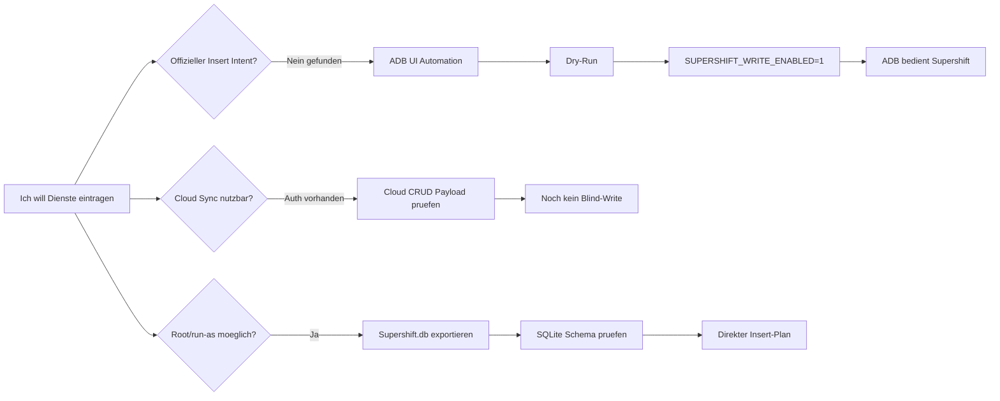

### APK inspizieren

Wenn du eine Supershift-APK oder dekompilierte Ressourcen hast:

```json
{
  "tool": "inspect_supershift_apk",
  "arguments": {
    "apk_path": "reverse/supershift/supershift-2026.18.apk",
    "aapt_path": "/Users/dein-name/Library/Android/sdk/build-tools/37.0.0/aapt",
    "manifest_path": "reverse/supershift/apktool/AndroidManifest.xml"
  }
}
```

Das Tool liefert unter anderem:

| Feld | Bedeutung |
| --- | --- |
| `badging.package` | Android-Paket, erwartet `app.supershift` |
| `badging.version_name` | App-Version |
| `badging.permissions` | z.B. `INTERNET`, `WRITE_CALENDAR` |
| `manifest.required_split_types` | Ob Base-APK ohne Splits installierbar ist |
| `manifest.exported_activities` | Von aussen startbare Activities |
| `manifest.deeplinks` | Gefundene URL-/Scheme-Routen |

### Split-APK Installation vorbereiten

Neuere Supershift-Versionen koennen als App Bundle/Split-APK ausgeliefert
werden. Dann reicht eine einzelne Base-APK nicht aus. Der MCP plant oder
startet `adb install-multiple`:

```json
{
  "tool": "install_supershift_apks",
  "arguments": {
    "apk_paths": [
      "base.apk",
      "config.arm64_v8a.apk",
      "config.xhdpi.apk"
    ],
    "dry_run": true
  }
}
```

Echte Installation ist absichtlich opt-in:

```bash
export SUPERSHIFT_REVERSE_ENABLED=1
```

Danach `dry_run` auf `false` setzen.

### Deep-Links testen

Die APK enthaelt Deep-Link-Routen fuer:

- `app.supershift`
- `https://supershift.app/i/...`
- `https://supershift.app/open/...`
- `https://supr.sh/i/...`
- `https://supr.sh/open/...`

Probe:

```json
{
  "tool": "probe_supershift_deeplinks",
  "arguments": {
    "urls": [
      "https://supershift.app/open/test",
      "https://supr.sh/i/test"
    ],
    "dry_run": true
  }
}
```

Auch hier gilt: echte Starts erst mit `SUPERSHIFT_REVERSE_ENABLED=1`.

### Lokale Datenzugriffe pruefen

Supershift Android 2026.18 nutzt lokal eine Room/SQLite-Datenbank:

```text
/data/data/app.supershift/databases/Supershift.db
```

Wichtige Tabellen:

| Tabelle | Zweck |
| --- | --- |
| `calendar` | Dienstkalender, z.B. `My Job` |
| `event` | Eingetragene Dienste/Ereignisse |
| `template` | Schichtvorlagen |
| `break` | Pausen |
| `notification` | Benachrichtigungen/Alarme |
| `calendar_sync_task` | Kalenderexport-Sync-Aufgaben |

Ob der MCP diese Daten auf deinem Geraet lesen oder schreiben kann, haengt von
Android, Debuggable-Status, Backup-Policy, Root und App-Sandbox ab.

```json
{
  "tool": "supershift_data_access_status",
  "arguments": {}
}
```

Wenn `run_as_available` wahr ist, kann ein Datenexport vorbereitet werden:

```json
{
  "tool": "pull_supershift_data",
  "arguments": {
    "output_dir": "/Users/dein-name/Supershift-Export",
    "dry_run": true
  }
}
```

### Direkter SQLite-Insert

Auf einem gerooteten Emulator wurde der direkte Schreibpfad verifiziert:

```text
event.date      = YYYYMMDD
event.startTime = Sekunden seit Mitternacht
event.endTime   = Sekunden seit Mitternacht
event.endDate   = YYYYMMDD, bei Nachtdienst Folgetag
event.calendarId = Row-ID aus Tabelle calendar, meist 1 fuer "My Job"
calendar_sync_task.calendarEntryUuid = event.eventUuid
```

Dry-Run:

```json
{
  "tool": "create_supershift_sqlite_shifts_from_text",
  "arguments": {
    "text": "26.06.2026 22:00-06:00 Nachtdienst @ Station B # Nacht",
    "calendar_row_id": 1,
    "dry_run": true
  }
}
```

Echte Ausfuehrung nur nach Backup:

```bash
export SUPERSHIFT_REVERSE_ENABLED=1
```

```json
{
  "tool": "create_supershift_sqlite_shifts_from_text",
  "arguments": {
    "text": "26.06.2026 22:00-06:00 Nachtdienst @ Station B # Nacht",
    "calendar_row_id": 1,
    "dry_run": false
  }
}
```

Der Writer fuehrt aus:

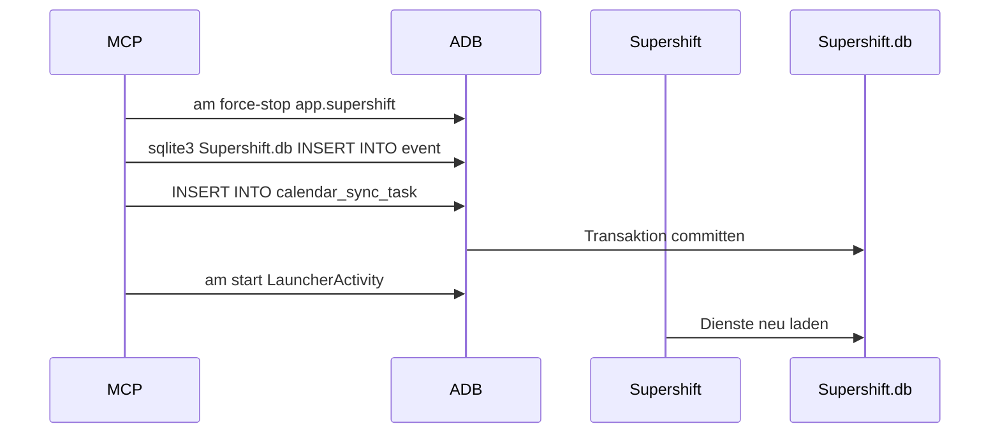

### Cloud-CRUD-Payload vorbereiten

Die APK enthaelt Retrofit-Endpunkte fuer Supershift Cloud:

| Zweck | Gefundener Pfad |
| --- | --- |
| Login | `POST https://supershift.app/api/login` |
| Account erstellen | `POST https://supershift.app/api/createAccount` |
| Sync Pull/Push | `POST https://supershift.app/api/v2/sync` |
| CRUD | `POST https://supershift.app/api/v3/crud` |
| Cloud-Daten pruefen | `POST https://supershift.app/api/checkCloudData` |

Fuer Dienstobjekte wurde diese Struktur abgeleitet:

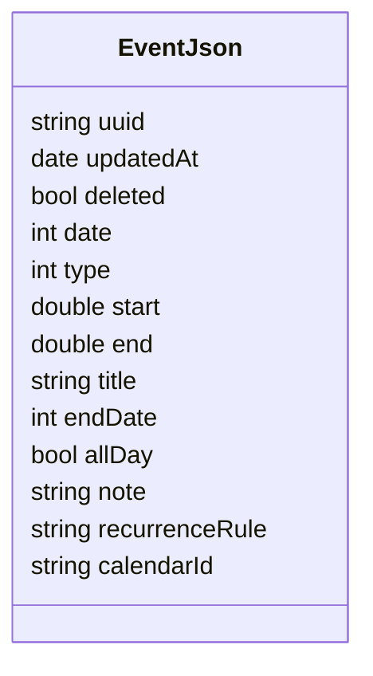

Preview erzeugen:

```json
{
  "tool": "preview_supershift_cloud_crud",
  "arguments": {
    "calendar_id": "DEINE-CALENDAR-ID",
    "shifts": [
      {
        "title": "Fruehdienst",
        "start": "2026-06-24T06:00:00+02:00",
        "end": "2026-06-24T14:00:00+02:00",
        "location": "Station A",
        "notes": "Team alpha"
      }
    ]
  }
}
```

Der MCP sendet diesen Payload nicht automatisch. Fuer echtes Cloud-Schreiben
braucht man mindestens gueltige Supershift-Auth, User-ID, Device-ID,
Calendar-ID, Sync-Schema-Version und Konfliktlogik. Ohne diese Werte waere ein
Write nicht hartnaeckig, sondern riskant.

## HTTP API verwenden

Die HTTP-API ist optional. Installiere das API-Extra:

```bash
python -m pip install -e ".[api]"
```

Starte den Server:

```bash
supershift-api
```

Standardadresse:

```text
http://127.0.0.1:8765
```

### HTTP-Endpunkte

| Endpoint | Beispiel |
| --- | --- |
| `GET /health` | `curl "http://127.0.0.1:8765/health"` |
| `GET /shifts` | `curl "http://127.0.0.1:8765/shifts?start=2026-06-01&end=2026-07-01"` |
| `GET /shifts/filter` | `curl "http://127.0.0.1:8765/shifts/filter?start=2026-06-01&end=2026-07-01&title_contains=Night"` |
| `GET /shifts/current` | `curl "http://127.0.0.1:8765/shifts/current"` |
| `GET /shifts/next` | `curl "http://127.0.0.1:8765/shifts/next?days=30"` |
| `GET /shifts/date/{day}` | `curl "http://127.0.0.1:8765/shifts/date/2026-06-24"` |
| `GET /shifts/{uid}` | `curl "http://127.0.0.1:8765/shifts/abc123"` |
| `GET /summary` | `curl "http://127.0.0.1:8765/summary?start=2026-06-01&end=2026-07-01"` |
| `GET /summary/period` | `curl "http://127.0.0.1:8765/summary/period?start=2026-06-01&end=2026-07-01&period=week"` |
| `GET /conflicts` | `curl "http://127.0.0.1:8765/conflicts?start=2026-06-01&end=2026-07-01"` |
| `GET /rest-periods` | `curl "http://127.0.0.1:8765/rest-periods?start=2026-06-01&end=2026-07-01"` |
| `GET /free-days` | `curl "http://127.0.0.1:8765/free-days?start=2026-06-01&end=2026-07-01"` |
| `GET /export` | `curl "http://127.0.0.1:8765/export?start=2026-06-01&end=2026-07-01&output_format=csv"` |
| `GET /pay` | `curl "http://127.0.0.1:8765/pay?start=2026-06-01&end=2026-07-01&hourly_rate=22"` |
| `GET /titles` | `curl "http://127.0.0.1:8765/titles"` |
| `GET /locations` | `curl "http://127.0.0.1:8765/locations"` |
| `POST /write/parse` | Freitext in Dienste parsen |
| `POST /write/validate` | Dienste validieren |
| `GET /android/status` | ADB-Geraete anzeigen |
| `GET /android/supershift` | Supershift App-Status pruefen |
| `GET /android/supershift/ui` | Supershift UI XML dumpen |
| `GET /reverse/apk` | APK/Manifest statisch analysieren |
| `GET /reverse/report` | Reverse-Engineering-Report anzeigen |
| `POST /android/supershift/install` | Base-/Split-APKs installieren, Dry-Run default |
| `POST /android/supershift/deeplinks` | Deep-Link-Probes starten, Dry-Run default |
| `GET /android/supershift/data` | `run-as`/Root-Datenzugriff pruefen |
| `POST /android/supershift/data/pull` | App-Daten exportieren, Dry-Run default |
| `POST /write/supershift/cloud/preview` | Cloud-CRUD-Payload vorbereiten |
| `POST /write/supershift/sqlite/preview` | Direkten SQLite-Insert-Plan vorbereiten |
| `POST /write/supershift/sqlite` | Strukturierte Dienste direkt in `Supershift.db` schreiben |
| `POST /write/supershift/sqlite/text` | Freitext direkt in `Supershift.db` schreiben |
| `POST /write/supershift` | Strukturierte Dienste schreiben |
| `POST /write/supershift/text` | Freitext parsen und schreiben |

## Datums- und Zeitformat

Empfohlen sind ISO-8601 Werte:

```text
2026-06-01
2026-06-01T08:00:00+02:00
2026-06-01T06:00:00Z
```

Ein Zeitraum ist immer `start` inklusiv und `end` exklusiv. Fuer einen ganzen
Monat nutzt du also:

```text
start=2026-06-01
end=2026-07-01
```

## Typische Workflows

### Monatsauswertung

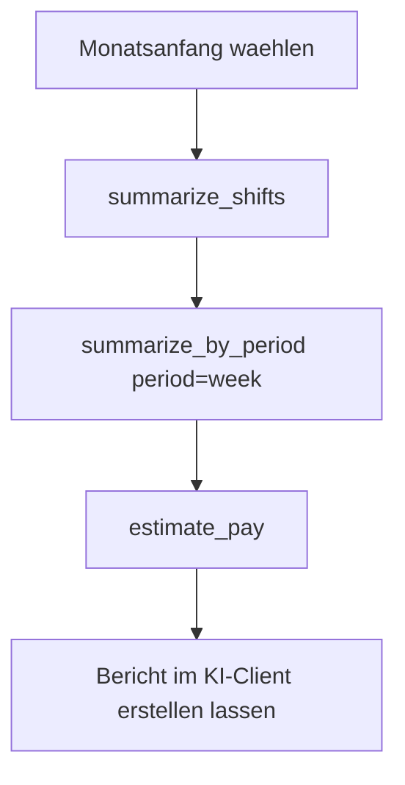

### Dienstplan-Check

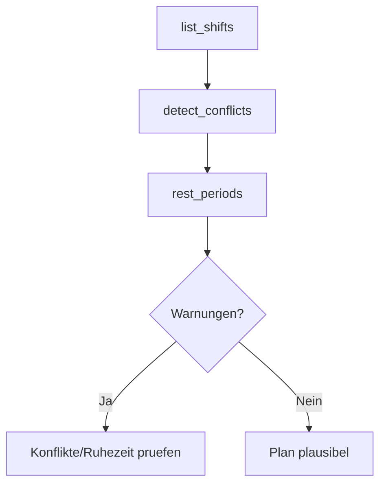

## Datenschutz und Sicherheit

- Die private iCal-URL ist ein Geheimnis.
- Lege `SUPERSHIFT_ICS` nicht in Git ab.
- ADB-UI-Schreiben ist standardmaessig Dry-Run.
- Echtes ADB-UI-Schreiben braucht `SUPERSHIFT_WRITE_ENABLED=1`.
- Reverse-Aktionen wie APK-Installation, Deep-Link-Start und Datenexport
  brauchen `SUPERSHIFT_REVERSE_ENABLED=1`.
- Cloud-CRUD wird nur als Payload-Preview erzeugt und nicht automatisch
  gesendet.
- Alte Realm-/Migrationsspuren werden nur analysiert; der live verifizierte
  direkte Pfad ist `Supershift.db`/SQLite.
- Direktes SQLite-Schreiben ist nur fuer eigene Geraete/Emulatoren gedacht und
  braucht Root oder gleichwertigen `/data/data`-Zugriff.
- Die HTTP-API bindet standardmaessig nur an `127.0.0.1`.
- Wenn du die API im Netzwerk erreichbar machst, schuetze sie selbst mit
  Reverse Proxy, Authentifizierung oder Firewall.

## Grenzen

Der stabilste Lesepfad bleibt der Kalenderexport. Fuer Schreiboperationen gibt
es mehrere experimentelle Wege, aber nicht jeder Weg ist auf jedem Geraet
verfuegbar:

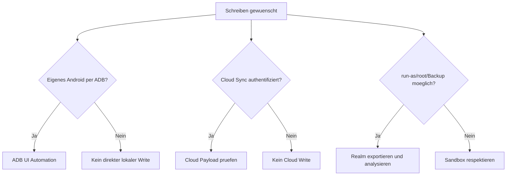

Nicht enthalten:

- Umgehung von App-Sandbox, Kauf-, Auth- oder Cloud-Schutzmechanismen
- Blindes Senden von Cloud-CRUD ohne verifizierte Supershift-Sitzung
- Blindes Mutieren lokaler Datenbanken ohne Backup und Schema-Nachweis
- Blindes Veraendern deiner Dienste ohne Dry-Run und explizite Schreibfreigabe

Enthalten sind dagegen kontrollierte Werkzeuge, die mit deinem eigenen Geraet,
deiner installierten App und deinen Daten arbeiten: UI-Automation, APK-Analyse,
Deep-Link-Probes, Datenzugriffspruefung und Cloud-Payload-Preview.

## Entwicklung

```bash
python -m pytest
ruff check .
```

CI laeuft in GitHub Actions bei Push und Pull Request.
